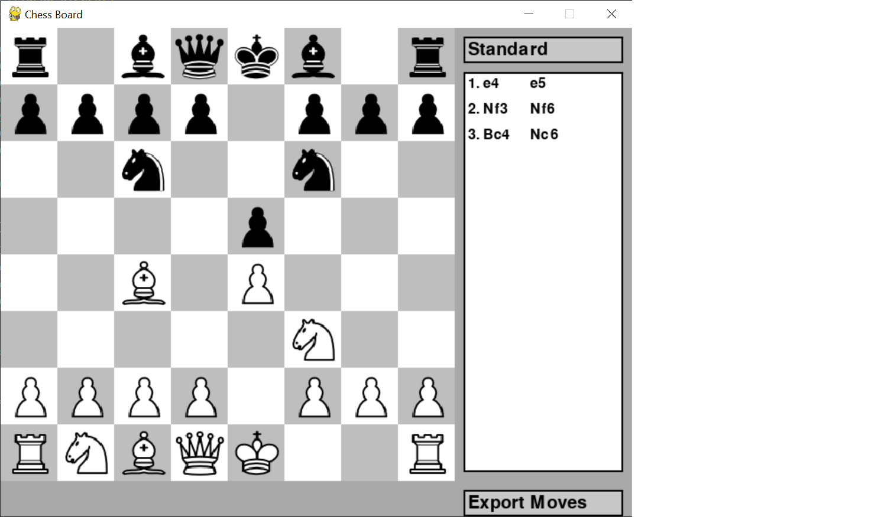
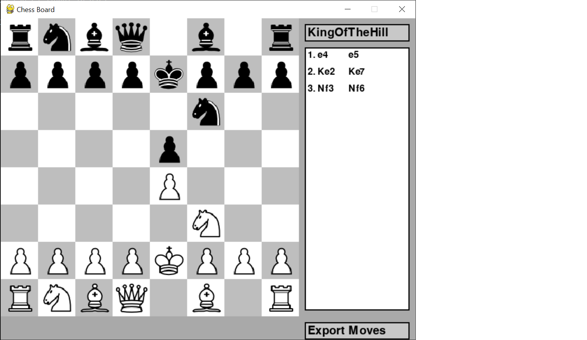

#Cele trei variante de sah descrise in documentatie: 

1.Anti chess: obiectivul e sa pierzi toate piesele sau sa ajungi in pat

2.King of the hill: obiectivul este sa ajungem cu regele pe unul dintre cele patru patrate din mijloc

3.Three-check:  obiectivul este sa dai sah regelui advers de trei ori

#Lista de functionalitati: 
1.Functionalitatea de baza a jocului de sah

2.Alegerea variantei de sah - standard si cele 3 variante mentionate mai sus

3.Lista de mutari facute de fiecare jucator in partea dreapta

4.Intoarcerea la o pozitie anterioara - cand un jucator da click pe una dintre mutari din lista, jocul se intoarce la pozitia unde mutarea selectata este ultima mutare facuta de un jucator

5.Exportarea mutarilor - lista de mutari este salvata intr-un fisier text in acelasi director cu aplicatia

Cateva exemple 

